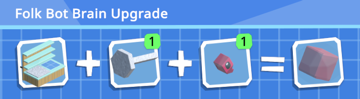
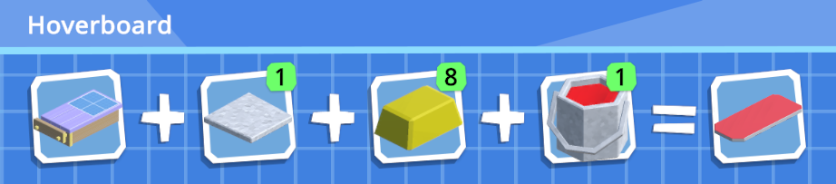
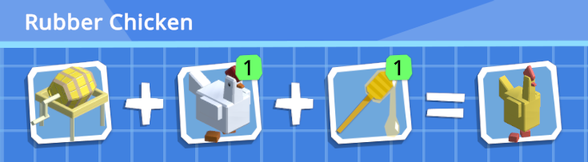
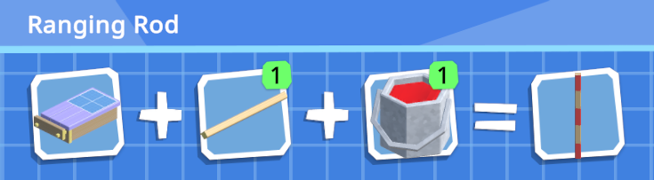

<p align="center">
	
</p>

# Modnauts Technical Documentation

**Modnauts** is a BepInEx-powered extension for **Autonauts** that unlocks deeper modding capabilities, providing expanded API hooks and custom classes to create previously "unmoddable" items.

## 📌 Contents
* [Key Features](#key-features)
* [Repository Structure](#repository-structure)
* [Installation](#installation)
* [Usage](#usage)
* [Examples](#examples)

---

## Key Features
*   **Expanded API:** Access custom classes (e.g., `ModUpgrade`) for creating new items without overriding vanilla content.
*   **BepInEx Integration:** Seamlessly bridges C# internal logic and Lua scripts.
*   **Type Safety:** Includes LuaCATS definitions for IDE autocomplete support.

## Repository Structure
*   **/src:** Core BepInEx plugin sourcecode.
*   **/docs:** Documentation.
*   **/resources/Mods:** This is a demo Mod showcasing the `ModUpgrade` functionality.
*   **/resources/meta:** IDE type definitions.

## Installation
1. Ensure you have [Autonauts 140.2](https://store.steampowered.com/app/979120/Autonauts/) installed.
2. Ensure you have [BepInEx 5.4.21](https://github.com/BepInEx/BepInEx/releases/tag/v5.4.21) installed for Autonauts.
3. Run Autonauts at least once with BepInEx installed to allow BepInEx to initialize.
4. Download the latest [Modnauts Release](https://github.com/duan-c/Modnauts/releases).
5. Copy the contents of the BepInEx\plugins folder into your game's BepInEx\plugins folder.
    - Typically C:\Program Files (x86)\Steam\steamapps\common\Autonauts\BepInEx\plugins
6. **Optional:** Place the contents of the Mods folder into your game's Mods directory.
    - Typically C:\Program Files (x86)\Steam\steamapps\common\Autonauts\Autonauts_Data\StreamingAssets\Mods
7. Modnauts is installed correctly if you see the Modnauts version under the game version in the main menu when running the game.

## Usage
To get the best development experience, we recommend using **VS Code** with the **Lua Language Server** extension.
The provided `ModUpgrade.d.lua` file allows you to see documentation and parameter types as you code

Refer to the [Official Autonauts Wiki](https://autonauts.fandom.com/wiki/Modding) for modding help.

## Examples

### Bot Memory
```lua
function Creation()
	ModUpgrade.CreateUpgradeWorkerMemory(
		"UpgradeWorkerMemoryFolk",
		96,
		{ "Piston", "FolkSeed" },
		{ 1, 1 },
		"FolkBrain",
		true
		)
    ModText.SetText("UpgradeWorkerMemoryFolk", "Folk Bot Brain Upgrade")
    ModText.SetDescription("UpgradeWorkerMemoryFolk", "They are useful after all")
end
function BeforeLoad()
	ModUpgrade.SetUpgradeLevel("UpgradeWorkerMemoryFolk", 3)
	ModVariable.AddRecipeToConverter("WorkerWorkbenchMk3", "UpgradeWorkerMemoryFolk")
end
```


### Player Movement
```lua
function Creation()
	ModUpgrade.CreateUpgradePlayerMovement(
		"UpgradePlayerMovementHoverboard",
		0.25,
		{ "MetalPlateCrude", "Butter", "PaintRed" },
		{ 1, 8, 1 },
		"Hoverboard",
		true
		)
    ModText.SetText("UpgradePlayerMovementHoverboard", "Hoverboard")
    ModText.SetDescription("UpgradePlayerMovementHoverboard", "")
end
function BeforeLoad()
	ModUpgrade.SetUpgradeLevel("UpgradePlayerMovementHoverboard", 3)
	ModVariable.AddRecipeToConverter("WorkbenchMk2", "UpgradePlayerMovementHoverboard")
end
```


### Whistle
```lua
function Creation()
	ModUpgrade.CreateUpgradePlayerWhistle(
		"UpgradePlayerWhistleRubberChicken",
		"WhistleCallRubberChicken",
		"WhistleCancelRubberChicken",
		"WhistleDropAllRubberChicken",
		"WhistleToMeRubberChicken",
		{ "AnimalChicken", "Honey" },
		{ 1, 1 },
		"RubberChicken",
		true
		)
    ModText.SetText("UpgradePlayerWhistleRubberChicken", "Rubber Chicken")
    ModText.SetDescription("UpgradePlayerWhistleRubberChicken", "")
end
function BeforeLoad()
	ModVariable.AddRecipeToConverter("ButterChurn", "UpgradePlayerWhistleRubberChicken")
	ModSound.ChangeSound("WhistleCallRubberChicken", "WhistleCallRubberChicken")
	ModSound.ChangeSound("WhistleCancelRubberChicken", "WhistleCancelRubberChicken")
	ModSound.ChangeSound("WhistleDropAllRubberChicken", "WhistleDropAllRubberChicken")
	ModSound.ChangeSound("WhistleToMeRubberChicken", "WhistleToMeRubberChicken")
end
```


### Sign
```lua
function Creation()
	ModUpgrade.CreateSign(
		"RangingRod",
		25,
		{ "Pole", "PaintRed" },
		{ 1, 1 },
		"RangingRod",
		true
		)
    ModText.SetText("RangingRod", "Ranging Rod")
    ModText.SetDescription("RangingRod", "Control Bot search areas. Press %kUseInHand while holding the sign to edit it.")
end
function BeforeLoad()
	ModVariable.AddRecipeToConverter("WorkbenchMk2", "RangingRod")
end
```

